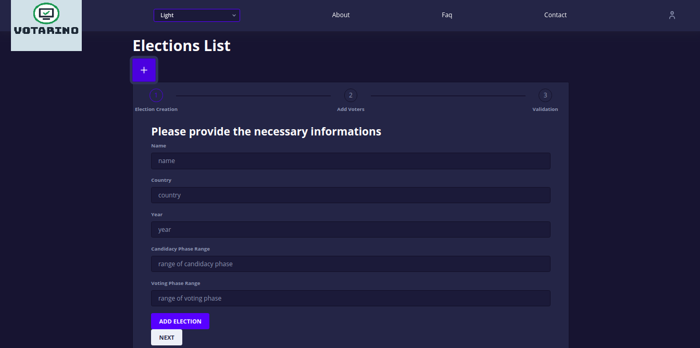
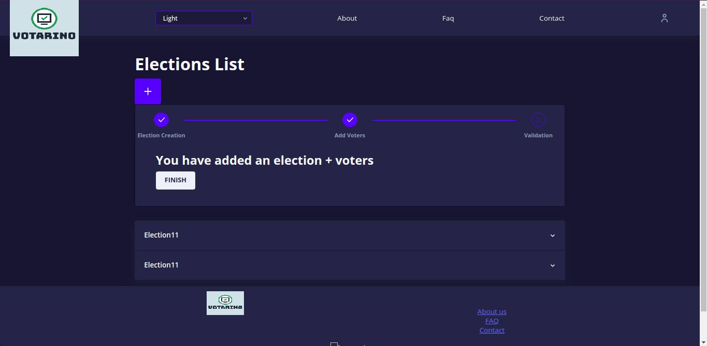
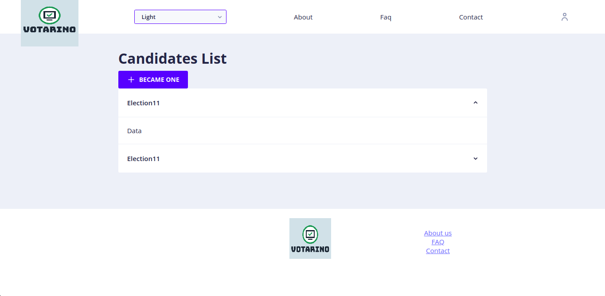
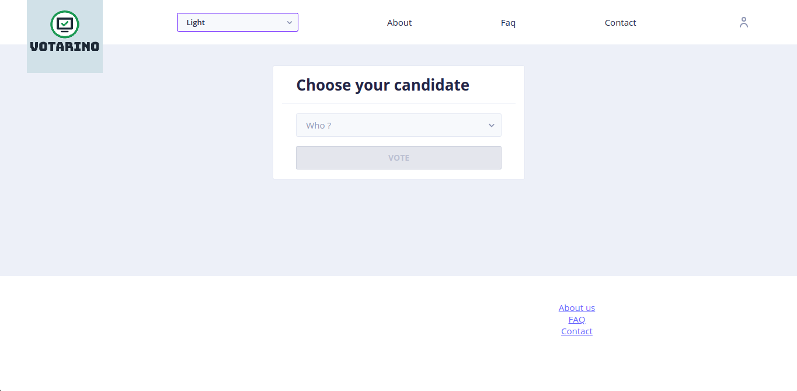

# votarino

### 

## About

votarino is e-vote platform based on blockchain technology. I implemented ths project part of my end of year project at INSAT - 2019. It was the first time I worked with hyperledger Fabric.

## Features

- A voter must only vote once.
- A vote is immutable.
- A voter can become a candidate (by provides candidature information).
- A candidate can deactivate his candidature.
- Candidature phase do not overlap with voting phase.   

To create the proof of concept for 'votarino' platform, I had to use truffle, ganache, solidity and web3(metamask) to implement the fundamentals features

### votarino development

After creating the PoC, My supervisor  suggested that we target the security concerns, we had to answer the questions:
- Does the app provide security to the user ?
- Does a public blockchain network matches the nature of 'election' (being private, anonymous, etc  ...) ?
- Does the app take into consideration the influence factor (someone forcing a choice on a voter) ? (to be honest, this is a hard question to answer)

After another session of auto learning, we opted to use the Hyperledger Fabric (it supports private networks), which is a part of the Hypeledger project initiated by the Linux Foundation, and has received contributions from IBM, Intel and SAP Ariba.

We added some functional requirement for our platform:

- Each election admin can create multiple elections
- Each election will have a list of members (default voters)
- Each election must be approved by a super admin
- Election results are only accessible after the voting phase

Using Hyperledger Farbic well detailed documentation, we developed our e-vote platform, titled 'votarino'.

## :dart: Next ?

There is a lot more to be done with this project, some ideas are:

- Implement different format of vote, like multiple choices, delegating vote, mutable vote, etc
- Emphasis more on security and utilize identity mixer to provide a pure anonymity for the voter
- Transform the platform into a SaaS product
## Screenshots

